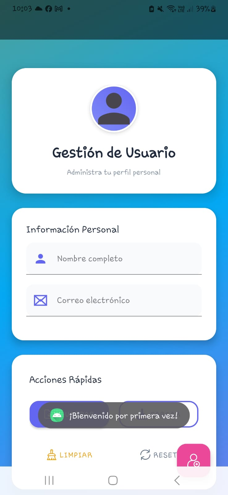

# 📱 UserProfile Manager - Gestor de Perfiles con SharedPreferences -S9

**Desarrollado por:** Valentino Guevara  
**Contacto:** [202114033@uns.edu.pe](mailto:202114033@uns.edu.pe)  
**GitHub:** [ValentinoGuevara](https://github.com/ValentinoGuevara)  
**Curso:** Aplicaciones Móviles - Semana 9  

<div align="center">
  
</div>

## 🔍 ¿Cómo funciona el programa?
Esta aplicación permite gestionar perfiles de usuario con persistencia local usando SharedPreferences. Su arquitectura se compone de:

### 🏗️ Núcleo del Sistema
1. **Almacenamiento Persistente**:
   - Usa SharedPreferences para guardar:
     - Perfil de usuario (nombre, edad, email)
     - Preferencias de tema (claro/oscuro)
     - Estadísticas de uso (contador de visitas)

2. **Flujo Principal**:
   ```mermaid
   graph TD
     A[Inicio] --> B{Primer uso?}
     B -->|Sí| C[Mostrar formulario]
     B -->|No| D[Cargar perfil]
     C --> E[Guardar en SharedPreferences]
     D --> F[Mostrar datos existentes]
Características Clave:

Cambio de tema en tiempo real sin reiniciar la app

Validación de campos obligatorios

Feedback visual con Snackbars

Sistema de limpieza segura de datos

📸 Galería de Capturas
Organiza tus imágenes en /screenshots así:
<div align="center">
  <h3>🎨 Interfaz de Usuario</h3>
  <table>
    <tr>
      <td></td>
      <td></td>
      <td></td>
    </tr>
    <tr>
      <td></td>
      <td></td>
      <td></td>
    </tr>
    <tr>
      <td></td>
      <td></td>
      <td></td>
    </tr>
    <tr>
      <td></td>
      <td></td>
      <td></td>
    </tr>
    <tr>
      <td></td>
      <td></td>
    </tr>
  </table>
  <p>¡Captura real de la aplicación en acción!</p>
</div>
🛠️ Implementación Técnica
Estructura de Código
kotlin
// Clase principal para manejar preferencias
class PrefsManager(context: Context) {
    private val prefs = context.getSharedPreferences("USER_DATA", MODE_PRIVATE)

    // Guardar tema seleccionado
    fun saveTheme(isDark: Boolean) {
        prefs.edit().putBoolean("DARK_MODE", isDark).apply()
    }

    // Cargar perfil de usuario
    fun loadProfile(): User? {
        return if (prefs.contains("USER_NAME")) {
            User(
                name = prefs.getString("USER_NAME", "")!!,
                age = prefs.getInt("USER_AGE", 0),
                email = prefs.getString("USER_EMAIL", "")!!
            )
        } else null
    }
}

## 🌟 **Sobre el Proyecto**  

Este proyecto fue desarrollado como parte de la **Semana 9** del curso de Aplicaciones Móviles, demostrando:  

### 🛠 **Tecnologías y Habilidades**  
- ✅ **Manejo profesional** de SharedPreferences  
- ✅ Implementación de **temas dinámicos** (claro/oscuro)  
- ✅ **Buenas prácticas** de persistencia local  
- ✅ Arquitectura **limpia y mantenible**  

### 📚 **Contexto Académico**  
Proyecto desarrollado para la **Universidad Nacional del Santa (UNS)**  
como evidencia de aprendizaje en desarrollo móvil con Android.  

---

## **Copyright © 2025 - Valentino Guevara** 
`
Prohibido uso comercial sin autorización expresa.
<div align="center">  <p>¡Explora el código y contribuye!</p> <a href="https://github.com/ValentinoGuevara/S9_SharedPreferences">  </a> </div> ```
